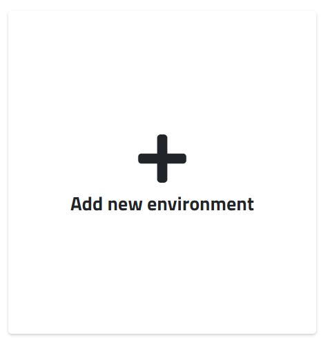

### DEPLOY YOUR PYTHON APPLICATION FROM A ZIP OR TAR ARCHIVE

Uploading all your files via FTP can be a tedious process, especially if you have lots of tiny files. With Enscale we made things easy for you, you can deploy directly from ZIP.

Since with Enscale your Python application will be running behind an Apache web server with _mod_wsgi_, you need to ensure that you have a proper [Application file](/python/deployment-guides/application-file). You should also make use of the [_requirements.txt_](/python/deployment-guides/pip-and-requirementstxt) file in order to install all of your application’s dependencies with pip install.

Depending on the size of your archive, you can use one of the two methods outlined below.

### Deploying a Python application from an archive up to 150MB

##### Step 1

Create your Python environment.

##### Step 2

Enter your environment and go to the deployment manager by clicking the **Deploy** button.

##### Step 3

In case you already deployed your project, it will show here so you don't need to upload it multiple times, just click **Select**. If your project is new, click **Deploy a new project**. 

##### Step 4

Select the **Archive** tab, find and upload your archive by clicking **Browse**.
Alternatively from the **Remote URL** tab you just need to enter the link to the file.

The following archive types are supported: _.tar_, ._tar.gz_, _.zip_ and _.bzip2_

!!! The default upload limit is 150MB. If your project archive is larger, please see the section [below](python/deployment-guides/archive#deploying-a-python-application-from-and-archive-larger-than-150m).

##### Step 5

Enter a description for your file - this comment will be attached to your project and will help you identify it in case you want to deploy the same project to several environments.

##### Step 6

Click **Deploy**.

!!!! Now that your code is deployed, you may wish to [configure the DNS](/environments/features/add-domain-name) for your domain.

### Deploying a Python application from and archive larger than 150MB

##### Step 1

Set up your SSH and SFTP connection. If you need any assistance with this, you can see our articles [Access via SSH](/environments/access/access-via-ssh) and [Access via SFTP](/environments/access/access-via-sftp) for detailed instructions.

##### Step 2
Connect to your node via SFTP and upload your archive. You can upload the following archive types: _.tar_, _.tar.gz_, _.zip_ and _.bzip2_

##### Step 3
Connect to your node via SSH.

##### Step 4

Locate your uploaded file and use the `unzip` or `tar` command to extract your files.

**.zip archives:**

`apache@node124718-cool-waterfall-59 ~/webroot/ROOT $ unzip django.zip`

**.tar archives:**

`apache@node124718-cool-waterfall-59 ~/webroot/ROOT $ tar -xfv django.tar`

**.tar.gz archives:**

`apache@node124718-cool-waterfall-59 ~/webroot/ROOT $ tar -xzfv django.tar.gz`

**.bzip2 archives**:

`apache@node124718-cool-waterfall-59 ~/webroot/ROOT $ tar -xjfv django.bzip2`

!!!! Now that your code is deployed, you may wish to [configure the DNS](/environments/features/add-domain-name) for your domain.